# Proyecot-de-Unidad-Desarrollo-Movil-integral-10
En este repositorio se documentara todos los avaces del proyecto de unidad de la Materia Desarrollo Movil integral de 10

# Jaguar Corporation 

| |
| -------------------------- |
| Logos |

## Organigrama del Equipo: 

 

## Estrucutura de Desarrollo del Proyecto: 

 

## Objetivo General

Desarrollar una aplicación móvil que permita optimizar la gestión y supervisión de las solicitudes de aprobación de procedimientos clínicos en el módulo de Dirección General del Hospital PrivilegeCare. La aplicación garantizará la actualización en tiempo real de las solicitudes, mejorando la eficiencia operativa y la coordinación entre las áreas correspondientes. Además, facilitará el seguimiento directo y la toma de decisiones administrativas dentro de las instalaciones hospitalarias, asegurando una respuesta ágil y efectiva a las necesidades clínicas y organizacionales.

## Objetivo Especifico

1. Facilitar a los especialistas de todas las áreas hospitalarias el envío eficiente de solicitudes para su evaluación por parte de la Dirección General, permitiendo que cada departamento pueda gestionar y coordinar sus requerimientos de manera integrada.

2. Garantizar la asignación de respuestas inmediatas y oportunas a las solicitudes que asegure el direccionamiento correcto hacia las áreas responsables, mejorando la coordinación interdepartamental.

3. Optimizar el flujo de solicitudes en función de la demanda y las prioridades, minimizando cuellos de botella y asegurando que los casos urgentes sean atendidos con rapidez.

4. Implementar una recopilación exhaustiva de datos sobre las solicitudes y respuestas, permitiendo el análisis post-proceso para identificar oportunidades de mejora, prevenir conflictos futuros y hacer ajustes que optimicen la gestión del sistema.

5. Garantizar tiempos de respuesta eficientes para todas las solicitudes, asegurando que ninguna quede sin ser atendida en un plazo razonable, lo cual beneficiará la calidad y rapidez de los servicios brindados a los derechohabientes.

6. Mejorar el control y la trazabilidad del personal encargado de gestionar las solicitudes, asegurando que cada procedimiento esté supervisado por personal capacitado, incrementando la eficiencia y efectividad en cada intervención.

7. Implementar mecanismos de priorización automatizados, basados en la urgencia y el tipo de solicitud, para garantizar que los casos críticos sean tratados de manera inmediata sin demoras innecesarias. 

8. Facilitar la transparencia y la trazabilidad de cada solicitud, asegurando que tanto los pacientes como los médicos puedan verificar el estado y la evolución de sus trámites en tiempo real, lo que aumentará la confianza en el sistema.

9. Mejorar la integración y comunicación entre áreas mediante una plataforma única que permita a todos los departamentos hospitalarios trabajar de manera colaborativa y eficiente en la gestión de las solicitudes.

## Proposito

El propósito de este proyecto es optimizar el tiempo de respuesta a las solicitudes dirigidas al área de Dirección del Hospital PrivilegeCare, mediante el desarrollo de una aplicación móvil que permita una gestión más eficiente y fluida. La app ofrecerá una experiencia de usuario intuitiva y accesible, facilitando a los especialistas y personal médico el envío y seguimiento de solicitudes en tiempo real. A través de la Dirección General, se establecerá un control eficiente con un sistema de validación prioritaria, que dará relevancia a las solicitudes clínicas más críticas, priorizando aquellas que representen riesgos para la salud de los pacientes. Esto no solo mejorará la eficiencia operativa del hospital, sino que también garantizará que las operaciones clínicas y administrativas se gestionen con altos estándares de rendimiento, contribuyendo a un servicio médico de calidad.

## Contexto de negocio

La gestión de un hospital puede abarcar varios sectores de la población a la que dirige sus servicios,  el modelo al enfoque de los servicios de alta calidad esta reservado para los hospitales privados donde por una cuota trimestral, seguro o plan anual, están obligados a ofrecer sus servicios con los estándares de calidad mas altos, sin embargo como se menciono  en un principio el sector de población de atención para este tipo se limita al valor  adquisitivo de sus clientes, por ende sus procesos de demanda no son tan exigentes como lo serian en el sector público.  

El nivel de atención en el sector publico se determina por la cantidad de pacientes que puede atender el hospital ofreciendo una amplia gama de servicios, ya sea para su derecho habientes inscritos en patrón de Seguro Social Nacional (SSN) o con consultas internas o externas dentro de, demás de incluir el compromiso de atención a todos aquellos que lo necesitan mediante una canalización de otras unidades medicas conectadas a la misma institución del Seguro Social, retomando el modelo de organización es importante que cada área este definida para poder dar un oportuno servicio a los derecho habientes, lo que puede ser complicado con la documentación innecesaria y procedimientos que retrasen a un más la atención de pacientes con enfermedades crónicas degenerativas. Sin contar la negligencia de personal que no esta altamente capacitado para dar un correcto servicio y manejo de la información de los pacientes. 

Un hospital publico se asocia con el sector comunitario y campañas gubernamentales, con las que promueve visitas a la comunidad mediante campañas de vacunación, donación de sangre, platicas de prevención y atención oportuna de enfermedades crónico degenerativas, concientización e información de enfermedades de contagio sexual, planificación familiar, tramites de registro poblacional y difusión de consulta gratuita para el sector mas vulnerable. Aquí es donde participa el sector privado que dona material para la atención medica del sector mas vulnerable, y haciendo alianzas de difusión para la mejora de la calidad de vida de las personas. Aunque algunas veces puede ser difícil abarcar a todo el sector, debido a la gran demanda de la solicitud de una atención medica de calidad. 

Los hospitales públicos están administrados por el gobierno mediante el surtido de su inventario, además algunas empresas contratadas por el gobierno se encargan de suministrar el material clínico y quirúrgico que necesita para la operación y atención de sus actividades, como también de otorgar el equipamiento necesario para poder trabajar en la atención de los pacientes, lo que nos lleva a que puede existir un desequilibrio en la gestión de los procesos por falta de utilización y administración de los bienes y recursos de un hospital, además que no hay un control, hacen más ineficiente la atención del público, lo que genera grandes conflictos en la calidad del servicio, es por ello que de manera más humana los médicos llegan a comprar el material para poder ayudar a sus pacientes. Estos problemas generados se dan por una mala administración en la gestión de los recursos por una inexistencia de solicitudes y un sistema que los esté administrando.

El sector privado es financiado por asociaciones privadas como lo son agencias de seguros y bancarias que influyen en sus clientes para la contratación de sus servicios haciendo una relación ganar – ganar, siendo su mayor activo la influencia en los medios masivos de comunicación y en la propagación de publicidad y “promociones“, para la adquisición de paquetes de cobertura de atención médica, aunque algunas entidades realizan actos de caridad y de responsabilidad civil para la sociedad creando fundaciones de captación de donativos públicos y privados, tratan de ayudar a las personas que mas lo necesitan, estas fundaciones de atención se especializan en sectores más vulnerables de la población como lo son los hospitales de tratamiento de enfermedades crónico degenerativas como lo es cáncer en todos sus ramos y tratamientos de enfermedades de trasmisión sexual (VIH), estos son algunos ejemplos donde su modelo no es ganar  - ganar, sino mejorar su relación con el sector poblacional de la región donde estén dando el servicio.

En el ámbito público las reglas son muy diferentes, aquí toda la relación interna y externa dependerá de la planeación estratégica mediante los modelos de estudio de poblaciones a nivel epidemiológico dando un seguimiento a los factores de atención mas importantes para su atención entre los que se incluyen, atención a enfermedades crónico degenerativas, atención a adicciones, consulta médica, tratamientos y un diagnóstico oportuno, todo en base a estudios constantes de sus pacientes inscritos en su patrón, es por ello que al detectar pacientes con una relevancia importante de atención son canalizados a las áreas de especialización para seguir su tratamiento, lo que puede llevar a un periodo de espera largo para su oportuna atención, al ser un sector saturado, toma con más relevancia a casos con mayor importancia de atención, lo que podría dejar vulnerables las áreas mas importantes de atención, sin embargo cada unidad depende de una regulación de operación mediante la autoridad clínica estatal y federal que revisan constante mente el comportamiento del sistema y la gestión de sus procesos.

Las normas para operación son mas estrictas para el área pública que en la privada ya que la entidad federal es la que debe de dar el visto bueno para su operación ajustando las actividades a las normas y convenciones establecidas para su operación como lo son las normas NOM 035 SSA3 2012 , NOM 027 SSA3 2013 entre otras que establecen los criterios y procedimientos que se deben de seguir para la producción, captación, integración, procesar, sistematizar, evaluar y divulgar la información en salud, además de establecer los criterios de funcionamiento y atención en los servicios de urgencias encada establecimiento de atención médica. 

En el sector publico el financiamiento esta atado al presupuesto anual federal del país, por lo que las mejoras de los bienes y servicios para el sector están programadas de manera anual y bimestral para todos los centros de atención, siendo los de mayor relevancia los centros de primer nivel, segundo nivel y tercer nivel de atención pública.  
Sin embargo las actualizaciones pueden ser pocas o debido a que la infraestructura necesaria para sustentar la demanda puede ser de bajo impacto, por lo que es imprescindible optimizar la manera de responder a la demanda de los procesos, es así como se busca una oportunidad dentro de ese sector de atención pública buscando solventar y optimizar algunos procesos de gestión que desahoguen la carga de trabajo, como lo son el manejo de inventarios, documentación y expedición de expedientes que faciliten el manejo de casos clínicos, gestión de personal en turno, manejo de expedición de estudios clínicos, como control de medicamentos y medicación hacia los pacientes, como una mejor optimización de conexión de la organización del hospital en tiempo real que ahorren el traslado de información hacia todos los departamentos existente en la instancia clínica, es así que salvo guardando la expedición de documentos se guardara aun mas el secreto clínico de los datos de los pacientes como un oportuna carpeta de documentación actualizada de manera digital, toda la información que ingrese al sistema esta monitoreada constante por personal capacitado para solventar los problemas que se ejecuten en la solicitud especifica de cierta formación. 

Todo lo mencionado estará sujeto a las políticas existentes para el manejo de la información y protección de datos, por lo que es importante la implementación de la seguridad informática encriptando la información confidencial que pudiese ser tomada por personal ajeno al autorizado, sin embargo, esto dependerá del nivel de seguridad que se dese implementar. 

## Organización de la Empresa

Cada una de las unidades clínicas que dan servicio están sujetas a una estricta organización que las sujeta a brindar un servicio eficiente, es por ello que el modelo que se seguirá esta en base al sistema de gestión de servicio público de tercer nivel de atención médica, la cual aborda una amplia gama de servicios de atención.

Todas las instituciones públicas como privadas cuentan con una dirección general que administra y supervisa el ejercicio dentro del trabajo diario de sus centros de atención, es por ello que la organización está establecida para otorgar y organizar los servicios integrales que ejerce cada departamento a su cargo. Siendo la cabeza, la Dirección General se encargará de supervisar y atender las necesidades de los departamentos que integra la unidad médica, como primera instancia se encuentra la junta de gobierno, encargada de mantener y ejecutar la idealización de una atención oportuna para los derechohabiente poniendo en primer lugar buscar las mejores soluciones que puedan salvaguardar la vida preservando la salud  como prevención oportuna, por lo que  considera de ejecutar y organizar los planes de acción para la mejora de la comunidad, aquí se establecen las políticas y las normas, además de integrar la misión y la visión que la unidad medica proyecta para el futuro. 

Dentro de la estructura Organizacional de la dirección general se toman todas las decisiones que ayuden a mejorar la atención médica, a qui se integra la dirección de cada uno de los departamentos, creando una comitiva estructurada para la toma de decisiones de alto impacto para toda la unidad médica, a nivel institucional su estructura es la que organiza en cierta medida como se solventarán las demandas correspondientes a cada departamento. 

Ya que las decisiones de mayor peso son una gran responsabilidad en un hospital, se integra un comité de trasplantes que junto a la dirección de alta especialidad como comité legal realizan y priorizan la candidatura a personas que necesitan de estos tratamientos delicados, por lo que se maneja una responsabilidad enorme dentro de este comité.

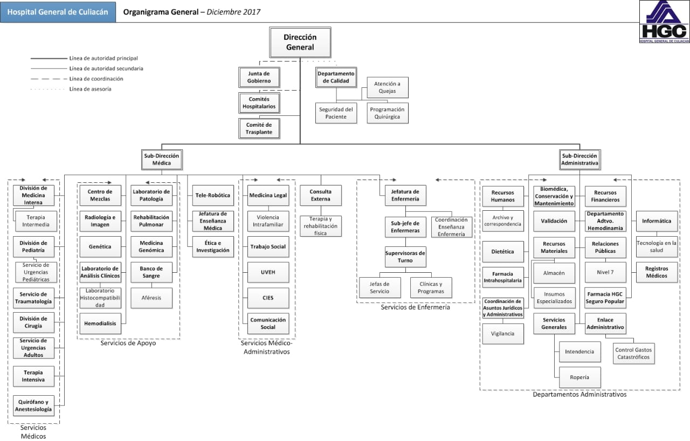

## Áreas Hospitalarias Involucradas 

|**Modulo** |**Descripción** |
| - | - |
|**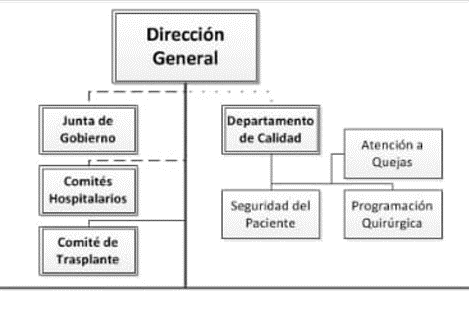** | Dentro de lo que se destaca de la organización en la estructura de la dirección general se tiene el departamento de seguimiento de calidad que vigila cada uno de los procesos llevados acabo como la atención a quejas y demandas, salva guardado de datos confidenciales de los pacientes como de archivos clínicos, y la programación y aprobación de intervenciones quirúrgicas. Dado a la descripción anterior esta es la cabecera del hospital, de aquí se divide en dos ramales principales que son la Sub dirección Médica y Sub Dirección Administrativa. La primera engloba todos los servicios que se ejercen para la práctica médica profesional, mientras la segunda se encarga de administrar los procesos que se llevan a cabo dentro del hospital tanto como internos como externos.|
|**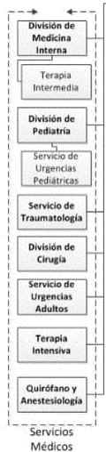** | Siendo más preciso, las áreas medicas están subdivididas en servicios integrales, la primera línea se enfoca en los servicios médicos de primer nivel de atención a los derecho habientes, entre ellos se encuentra la división de medicina interna, conectada con la terapia intermediaria como subnivel de atención de este departamento, como segundo ramal se cuenta a atención pediátrica que se enfoca a la atención de niños y adolescente con un ramal de servicio de urgencias pediátricas de especialidad, como tercer ramal se encuentra la atención de traumatología y servicios de radiología, aquí se incluye también dentro de los ramales la división de la organización de cirugías rutinarias, junto a la atención de urgencias geriátricas, y tratamiento a pacientes de terapia intensiva, como salas de operaciones y departamentos de intervenciones quirúrgicas. |
|**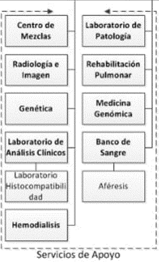** |El siguiente modulo administra los servicios de apoyo que son departamentos que se encargan del análisis exhaustivo de estudios y pruebas esenciales para un mejor pronostico clínico en el diagnostico oportuno como lo son departamentos de análisis patológico, estudios genómicos, banco de sangre, laboratorio de estudio de histocompatibilidad, estudios hemáticos y hemodiálisis, laboratorio de estudios generales de análisis clínicos, como la toma de estudios de radiología e imagenología clínica. |
|**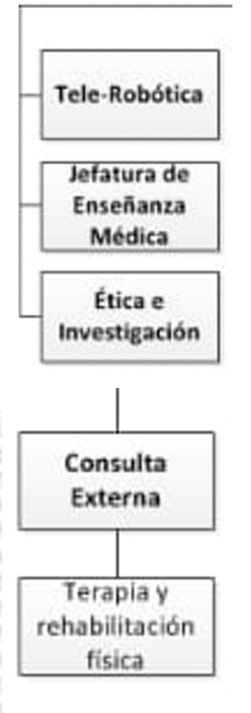** |Dentro de la sub direccion Medica existendepartamentos que conectan directamente a esta seccion, siendo el area de Tele-robotica para la investigacion e implementacion de procedimientos clinicos como la rama de investigadores del area medica que engloban protocolos de investigacion y participacion en la mejora de la rama de salud, como tambíen la eseñansa clinica a estudiantes del area medica para realizar practicas profesionales, la subdireccion es la encargada directamente de canalizar el flujo de la atencion de los pacientes ambulatorios para la consulta medica como canalizar los hacia otra areas de atencion medica que necesiten de una consulta extena como terapias adicionales quemejoren su calidad de vida. |
|**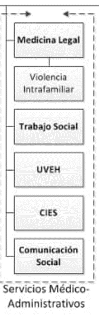** |Para un mejor orden de la legalidad del servicio y casos de estudio clínico se encuentra el área de Servicios Médicos Administrativos que canaliza los casos de acuerdo a la asignación legal correspondiente, tratando de buscar las mejores soluciones que ayuden a mejorar la calidad de vida de quien está involucrado en actos de legalidad de acuerdo al rubro de gravedad de su situación física. Integrando en primer plano el área de medicina legal, conectada directamente a la atención de victimas de violencia intrafamiliar, esta dependencia canaliza los casos con el área de trabajo social para la ejecución de las acciones legales, también se encuentra la unidad de vigilancia Epidemiológica hospitalaria (UVEH), que implementará los planes de acción en caso de requerir una intervención mayor y mejora de casos especiales o de índole delicada que perjudique la salud poblacional. Junto a las instituciones de investigación clínica el Centro de Investigación Epidemiológica de esta unidad, se encargarán de seguir los protocolos de seguridad en caso de contingencia sanitaria. También dentro de este departamento se encuentra el área de comunicación social, que se encargará de publicar campañas y servicios a implementar dentro de la unidad médica. |
|**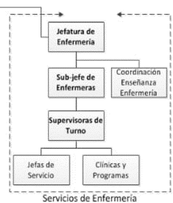** |La Subdirección Medica también respalda el área de servicios de Enfermería coordinando su personal interno dentro de las áreas de atención de especialización clínica organizando su plan de trabajo, la Jefatura de Enfermería organizará su subdepartamentos en cabezas de mando al igual a la capacitación de personal de enfermería en formación, se encargara de turnar a su personal mediante roles específicos dando respuesta oportuna a las demandas de los pacientes y como apoyo altamente calificado al personal médico.  |
|**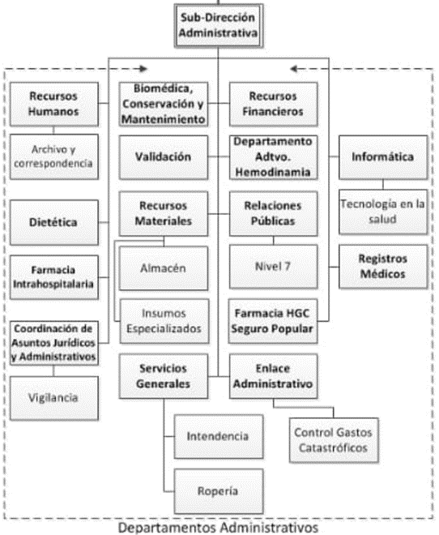** |La subdirección de Administración es un ramal con una organización que administra los recursos y actividades que giran en torno al hospital, dividida en departamentos documenta los procesos y protocolos a seguir para su ejercicio, involucrando principalmente el área de recursos humanos encargada de la administración del personal que labora en todas las áreas del hospital llevando y registrando en el área de almacenamiento de información útil para los datos históricos de sus empleados. Se encuentra el área de dietética que lleva los registros de nutrición de pacientes y los tratamientos administrados para la mejora de su condición. Se Encuentra el área de Farmacia que administra y suministra los medicamentos para las áreas requeridas y a los pacientes que lo necesitan. Se encuentra el área de asuntos legales y jurídicos que supervisan las actividades realizadas de acuerdo a las normativas y legalidades de los procedimientos médicos ejercidos dentro de la instalación hospitalaria junto al departamento de vigilancia y seguridad supervisan el orden y correcta ejecución de las actividades clínicas. |

La colaboración de departamentos es esencial para una operación optimizada, es por ello que la organización dependerá la aprobación de ciertos sectores de acuerdo a la prioridad de las demandas y las necesidades a atender para una mejora del servicio, tal es el caso de la supervisión de los recursos financieros que equipará a los sectores con mayor prioridad, junto al área de recursos materiales y la de validación operarán en conjunto, y se dará mantenimiento a las instalaciones de acuerdo a los periodos establecidos por las normativas por el estado, todos los recursos disponibles y surtidos deben de ser inventariados y almacenados en perfecto estado para su uso en el hospital, así se asegura que se brinda servicio de calidad con une equipamiento de tercer nivel de atención médica.    

Las relaciones publicas con los sectores involucrados permitirán tanto la activación de la materialización del hospital como la entrada de nuevas tecnologías de uso médico, y relaciones publicas con personal de alta especialización con otros hospitales del país, lo que abrirá al sector publico y privado una seguridad de que los procedimientos médicos cumplen con los estándares de calidad y servicio. 

Para la operación del hospital es imprescindible el departamento de intendencia y ropería, siendo aplicando las metodologías de asepsia calificada para las actividades clínicas y quirúrgicas que son esenciales en la operación del hospital.

El área administrativa cuenta con el área de informática y aplicación tecnológica en la salud operando en manera conjunta para brindar un servicio medico de calidad para los usuarios del hospital.
Dentro de la administración del hospital es fundamental llevar un registro de todos sus derecho habientes e intervenciones y procedimientos que se han llevado, por lo que cada paciente tendrá un registro de las actividades clínicas y procedimientos que se han administrado para mejorar la calidad de vida. 

## Proceso De Negocio

Anterior mente se ha comentado de manera general como esta organizada la operación del servicio médico, al entender que cada sector lleva un mando de responsabilidad y actividades específicas, es por ello que se abordará solo en las actividades operativas que se ejecutan dentro de la dirección general del hospital, siendo la cabeza central que administra en conjunto todos los departamentos que involucra las actividades clínicas ejercidas, se especializa en generar datos que aprueben y avalen todos los procedimientos que se ejecutan en las instalaciones. 

Dentro de los parámetros operacionales del hospital se mencionarán algunos procedimientos que permiten hacer una correcta dirección.

## Planificación

La planificación de hospitales en escala regional permite una distribución mejor y más equitativa de los servicios, particularmente en las comunidades menos prósperas, donde las necesidades suelen ser mayores. También permite ejercer cierto control que asegure un nivel relativamente uniforme de atención médica en toda la región.

Cabe destacar que la administración de un hospital dependerá del nivel de atención a las necesidades de la población a quien van dirigido los servicios. La OMS (Organización Mundial de la salud) distingue tres tipos de hospitales:

1)	El hospital regional, destinado a proporcionar toda clase de tratamientos incluso los especializados como los de radioterapia, neurocirugía, cirugía torácica y cirugía plástica. Siempre que fuera posible, este hospital comprendería o estaría vinculado a escuelas o facultades de medicina, estratégicamente localizado en la región a fin de que todos los pacientes que necesitaran sus servicios altamente especializados pudieran ser enviados fácilmente a él. 

2)	El hospital de categoría intermedia (o de distrito) con varios centenares de camas, que proporcionaría un excelente tratamiento de medicina, cirugía, obstetricia y otras especialidades. 

3)	El hospital local (o rural) con 20 a 100 camas, probablemente no asignadas para enfermedades específicas, que facilitaría servicios de medicina general, cirugía y maternidad.

Entre los principales factores que hay que tener en cuenta para definir la extensión de una región hospitalaria figuran los mayores centros de población, los hospitales más importantes ya establecidos y las líneas de comunicación. 
Uno de los objetivos ha de consistir en lograr que la región sea autosuficiente en la provisión de todo tipo de servicios de atención médica, y en los casos en que se incluyan centros de radioterapia, neurocirugía y cirugía cardiaca, para los cuales se requiere un alto grado de adiestramiento, cuerpo médico muy numeroso y equipo sumamente costoso, es preciso que la región comprenda grandes núcleos de población para mantener a todo este personal y equipo plenamente ocupado, trabajando con el máximo de eficiencia para justificar los cuantiosos gastos generales que implican estos servicios. 

Siempre que las comunicaciones sean aceptables, el tamaño geográfico de una región no tiene gran importancia, pero es conveniente que comprenda una población de dos a cinco millones de habitantes. 
Conviene incluir, siempre que sea posible, un hospital universitario y colaboración con facultades de medicina dentro de cada sistema regional, para que trabaje en estrecha colaboración con el hospital de la región a fin de que pueda ejercer su influencia académica y fomentar programas de educación médica para graduados y de investigaciones en todos los hospitales de la región. 

Los hospitales generales, que cuentan con una amplia variedad de servicios de especialistas, tienden a prestar tratamiento a hombres, mujeres y niños que padezcan cualquier tipo de enfermedad, con la sola excepción de las altamente infecto-contagiosas y las peligrosas, tales como la viruela.

Por otra parte, el hospital no debe tener menos de 200 camas, puesto que esto dificultaría o imposibilitaría la prestación de diferentes servicios. Un hospital de 500 camas permite establecer buenos departamentos de medicina general, cirugía general, pediatría, obstetricia y psiquiatría, conjuntamente con los servicios de especialidades corrientes, de tal forma que los departamentos sean lo suficientemente grandes para que esté justificado el nombramiento de especialistas a tiempo completo o parcial. Estos habrán de ser hombres o mujeres consagrados fundamentalmente a su labor en el hospital de distrito ya que cuanto más pequeño sea el hospital general, más difícil resultará contar con el número de camas necesario para las diversas especialidades dentro de la medicina y la cirugía general.

El hospital general moderno debe tener servicios para el internado de pacientes mentales, de enfermos crónicos (para el diagnóstico, evaluación, y tratamiento a corto plazo) y para aquellos que padezcan de enfermedades agudas transmisibles. Con excepción de los servicios de obstetricia, pediatría, aislamiento y psiquiatría, que requieren una planificación especial, todos los demás servicios de pacientes deben ser diseñados de acuerdo con normas uniformes, lo cual permite una mayor flexibilidad en su uso, aumenta los índices de utilización y contribuye a que el hospital pueda hacer frente mejor a las fluctuaciones estacionales en la incidencia de enfermedades.

## Costos y Utilización del Hospital

En un hospital bien dotado, con todos los servicios e instalaciones auxiliares, una cama puede costar tanto como lo que algunas personas ganan durante toda su vida; y su costo anual de sostenimiento equivale en muchos países a varias veces el promedio anual de los ingresos de un individuo. Por consiguiente, los hospitales pueden absorber fácilmente una proporción excesiva del presupuesto de salud de una nación, dejando muy poco disponible para los servicios preventivos más importantes, que pueden reducir considerablemente las necesidades de asistencia hospitalaria en lo futuro.

Para restringir en lo posible el costo hospitalario y utilizar con el máximo de economía este costoso servicio de salud, deben observarse tres principios: 

1)	Primero, el edificio no debe ser más complicado de lo necesario para que el hospital desempeñe la función que le corresponde dentro del sistema de asistencia médica. 
2)	Segundo, sólo deben admitirse aquellos pacientes cuyas necesidades no pueden atenderse por medios más económicos.
3)	Tercero, no debe desperdiciarse nada del tiempo que el paciente pasa en el hospital.

Es muy frecuente encontrar hospitales construidos con el criterio de que se puede conseguir personal suficiente, y cuando se inauguran, salas enteras y consultorios permanecen total o parcialmente inutilizados porque no puede conseguirse el personal necesario o no se dispone del dinero indispensable para pagarlo.

Los servicios de salud para la comunidad debidamente establecidos son indispensables para prevenir el despilfarro de los recursos hospitalarios. Por ello, como ya se ha indicado, antes de decidir el tamaño de un hospital que prestará servicios a una colectividad dada, debe hacerse un estudio realista de las necesidades de salud de esa colectividad. 
El análisis inteligente de los costos de un hospital puede ser una guía valiosa para la administración del mismo. Como otros datos estadísticos, los datos de costos son onerosos y sólo deben reunirse cuando se van a emplear como un auxiliar de la administración. El primer paso es separar los costos de los pacientes hospitalizados de los ambulatorios; un segundo paso es separar los servicios proporcionados al personal de los pacientes. Es necesario establecer unidades de servicios para cada departamento, como cocinas, lavanderías, calderas, así como departamentos de anatomía patológica y de rayos X, de tal manera que puedan hacerse comparaciones provechosas entre los hospitales a base de los costos por unidad o servicio básico.

Un sistema de costos tiene por objeto plantear los problemas que requieren investigación. No pueden obtenerse conclusiones acerca de la eficiencia de un hospital mediante comparaciones brutas de los costos por día de hospitalización. Deben tomarse en consideración los tipos de enfermos que han sido atendidos, y si al salir van los pacientes a sus casas, a residencias baratas para convalecientes o a otros servicios para los últimos períodos de su asistencia.

Debe tomarse en consideración la eficacia del tratamiento; por ejemplo, si alguno de los pacientes tuvo que ser readmitido en el mismo hospital o en otro. Cuando los casos y la eficacia del tratamiento son similares, importa más el costo por caso tratado que el costo por día de hospitalización; en otras palabras, el tratamiento más activo y completo, aunque cuesta más por día, puede dar lugar a una reducción proporcionalmente mayor de la duración de la estancia. De este modo, un hospital aparentemente costoso puede ser en realidad más eficaz y más económico que otros.

Desde el punto de vista del paciente, su ingreso en un hospital puede ser un desastre financiero. Una enfermedad grave tiene el doble efecto de hacer que el paciente gaste en servicios médicos y, al mismo tiempo, de reducir notablemente su capacidad para financiarlos (salvo, por supuesto, si el paciente disfruta de considerables ingresos, pensiones, etc.). En general, un paciente hospitalizado cuesta mucho más que uno que no necesita hospitalizarse y, como se indicó anteriormente, el costo de un día en el hospital puede ser varias veces superior a su ingreso diario normal cuando trabaja. Por esta razón y por el hecho de que la necesidad de asistencia hospitalaria es mayor entre los ancianos que entre los jóvenes, casi todos los países del mundo han establecido ciertos medios para permitir a algunos o a todos los pacientes pagar indirectamente.

## Índices para evaluar la Utilización del Hospital

Los diversos índices pueden calcularse con carácter bruto o especifico. Un índice bruto es el que expresa el promedio de utilización general de todos los tipos de hospital de la región. En cambio, el índice específico expresa la utilización de un tipo de hospital o de un determinado servicio dentro del hospital. Estos diversos índices pueden clasificarse en dos categorías principales: 

**•	Los concernientes a datos relativos al hospital, tales como el número de camas, días de hospitalización e ingresos, altas y defunciones.**

**•	Los concernientes a la población expuesta.**

1.	Camas de hospital. Una cama de hospital es la que está mantenida y atendida con regularidad por personal profesional, el número total de tales camas constituye la dotación normalmente disponible del hospital.

2.	Ingresos. Los ingresos se refieren al número anual de admisiones en un hospital de pacientes que van a recibir atención médica y cuya estancia se espera que dure una o más noches.

3.	Altas y defunciones. El número anual de altas comprende el número de pacientes que dejan el hospital (curados, mejorados, etc.), el número de los trasladados a otras instituciones de salud o sociales y el número de los fallecidos.

4.	Días de hospitalización. Es la unidad de medida que indica el servicio prestado a un paciente hospitalizado entre los censos efectuados en dos días sucesivos. A veces, el día de ingreso y el día de alta se cuentan como un día. 

5.	Promedio de días de estancia. Este índice indica el período promedio de hospitalización (en días) por paciente hospitalizado.

6.	Tasa de ocupación de camas. La tasa de ocupación de camas refleja la relación entre las camas usadas y las camas disponibles.

7.	Intervalo de reocupación. El intervalo de reocupación expresa el período promedio de días que una cama permanece vacía, o, en otras palabras, el promedio de tiempo que transcurre entre el alta de un paciente y el ingreso del siguiente.

8.	El cálculo de los índices relativos a la población expuesta. tiene por objeto saber en qué grado utiliza la población los servicios del hospital; es necesario, por tanto, conocer el número de habitantes de esa población.

9.	Tasa de ingreso. La tasa de ingreso, denominada también tasa de frecuentación del hospital o de asistencia al hospital y designada se expresa de ordinario por el número de ingresos en el hospital por 1000 habitantes y por año.

10.	Tasa de hospitalización por habitante. Esta tasa expresa el volumen de la hospitalización en función del número de días de hospitalización por persona y por año.

## Índices para Evaluar la Utilización del Hospital

Los diversos índices pueden calcularse con carácter bruto o especifico. Un índice bruto es el que expresa el promedio de utilización general de todos los tipos de hospital de la región. En cambio, el índice específico expresa la utilización de un tipo de hospital o de un determinado servicio dentro del hospital. Estos diversos índices pueden clasificarse en dos categorías principales: 

## Administración y Organización del Hospital

Se entiende por hospital público un establecimiento o grupo de establecimientos creado y administrado por una autoridad pública. En algunos casos esta autoridad es local y corresponde a un municipio. En otros casos, puede crear y administrar el hospital público una colectividad más vasta, como un departamento, provincia o región, constituida por un número más o menos grande de municipios. En este caso, es administrado por los servicios departamentales o regionales. Finalmente, el propio Estado puede crear y dirigir el hospital público y encomendar su administración a un ministerio.

La inspección pública de estos establecimientos suele ejercerse de forma más o menos semejante en los diversos niveles, por tres razones:

1.	Las condiciones higiénicas están sometidas a la inspección de las autoridades de salud, y esa inspección comprende por regla general la ejecución forzosa de ciertas normas, técnicas y la inspección por el servicio de salud pública. 

2.	Debe existir una coordinación entre los hospitales públicos y los privados para evitar la duplicación del equipo y de los servicios. Ello puede conseguirse determinando el número total de camas necesarias en una zona determinada y sometiendo a una autorización oficial cualquier aumento del número de camas públicas o privadas. 

3.	La extensión de la atención médica a las personas indigentes y de los servicios de seguridad social a los trabajadores significa que una proporción cada vez mayor de los pacientes admitidos en los hospitales de todo tipo, dejarán de pagar la totalidad de los costos de diagnóstico y tratamiento y que los presupuestos de los hospitales públicos y privados dependerán cada vez más de los pagos del seguro de enfermedad y de otros fondos de asistencia social. Estas entidades financieras tienden naturalmente a exigir el derecho de fiscalización de las finanzas y el funcionamiento de los hospitales privados, comprendidos los de carácter comercial. Este es uno de los resultados de la incesante elevación del costo del tratamiento médico y hospitalario y conduce finalmente a la fiscalización presupuestaria por parte de las autoridades públicas.

## Evaluación de las Necesidades

Una vez establecido el número de pacientes que solicitarán atención en los diversos departamentos del hospital, se pueden calcular los requerimientos del hospital. Suponiendo que cierto número de pacientes ambulatorios se presentarán en las clínicas quirúrgicas en un mes, se podrá determinar el personal de la clínica y el número de consultorios, haciendo un cálculo del promedio de tiempo que durará cada consulta. De la misma manera, para determinar el número de camas que pueden necesitarse para medicina, cirugía, obstetricia y otros departamentos, será necesario calcular no sólo el número de pacientes que solicitarán el ingreso sino también la duración de su estancia en el hospital. A partir del número de camas y del presunto número de consultas de pacientes externos, es posible definir aproximadamente las necesidades de los departamentos del servicio médico, como los de radiodiagnóstico y laboratorio. Habrá que tener en cuenta asimismo en qué extensión se piensa poner a la disposición de los médicos generales y los departamentos de diagnóstico.

En esta etapa del estudio será posible también calcular aproximadamente la "población" del hospital, comprendidos los pacientes y el personal de diversas categorías. Estas cifras son importantes porque permiten calcular aproximadamente los requerimientos de los departamentos de servicios no médicos: provisión de víveres, lavandería, almacenes, sala de calderas y otros. Los datos sobre el personal permiten también establecer previsiones para su alojamiento.
Al terminar los cálculos descritos, será posible establecer, en términos generales, la capacidad necesaria del edificio para las diversas secciones del hospital. Será posible asimismo calcular la demanda que el hospital hará de los servicios públicos, tales como agua, electricidad, gas y alcantarillado. 

## Propuesta Frond-End

|**Sketch** |**Descripción** |
| - | - |
|**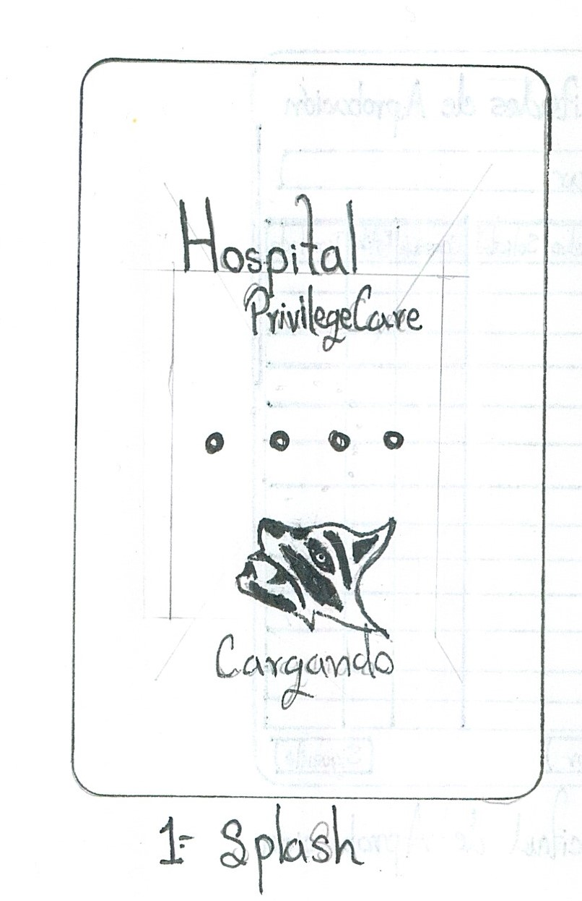** | La propuesta en el diseño de la aplicación ejemplifica una carga previa momentánea, esta se activa inmediatamente al dar apertura a la aplicación permitiendo cargar todos los elementos necesarios para la funcionalidad de la aplicación. |
|**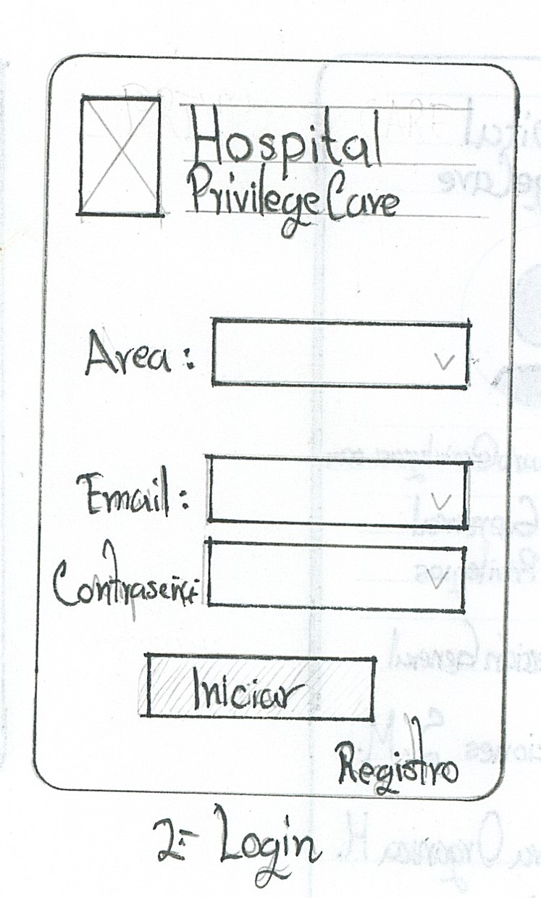** | La vista de inicio secundaria permite realizar el logue correspondiente del usuario, sin embargo, se abordará en el diseño la discusión si se le sugiere al usuario dejar su inicio de sesión activa o que introduzca datos de validación en la apertura de las funciones del sistema. |
|**** |Se necesita un registro previo existente para dar apertura a los permisos por lo que el usuario podrá registrarse a la plataforma con el llenado de sus datos personales, los cuales se resguardarán por el sistema.|
|**** |Al existir un registro válido el sistema apertura la información disponible por parte del usuario asignado, en esta vista aparecerá la imagen del usuario con privilegios como las áreas correspondientes para su interacción con los servicios disponibles. |
|**** |La vista de solicitudes registrará toda la información necesaria que se requiere para que se asignen los permisos necesarios para la resolución de cada solicitud por los departamentos aledaños a la institución.|
|**** |La estructura orgánica organiza la distribución de los departamentos hospitalarios y monitoriza permanentemente sus actividades por lo que la dirección general podrá hacer los cambios correspondientes de acuerdo a los criterios que su gestión requiera.|
|**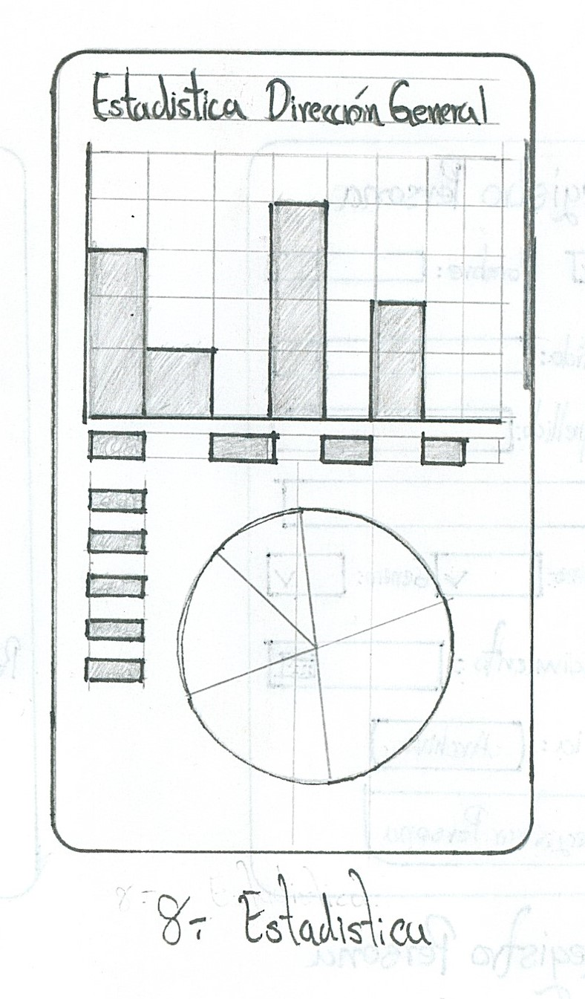** |La información recabada del área de dirección general hospitalaria se plasmará con datos históricos en gráficos que permitan evaluar los movimientos realizados en periodos asignados para la modificación y toma de decisiones para la mejora de los departamentos, estos datos permitirán dar las observaciones necesarias para la mejora de servicios hospitalarios.|
|**** |Cada uno de los registros realizados en la ejecución del sistema se anotará en la bitácora de actividades como control en la asignación de tareas y permisos correspondidos a las áreas de solicitud, evitando conflictos administrativos futuros. |
|**** |Se incluye dentro del desarrollo de la aplicación las normativas legales para poder ejecutar el sistema reasignando responsabilidad y compromiso en la privacidad de la información contenida y la resguarda de datos personales en base a la ley vigente.|
|**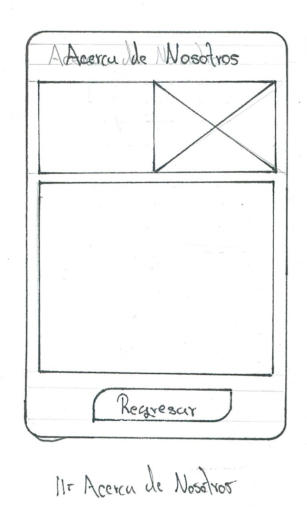** |Se anexa una vista dedicada a los desarrolladores del proyecto donde se especifica de manera breve la versión y el cuerpo de desarrolladores, como los derechos de autor e involucrados en el proyecto. |

|**Wireframes en Figma** |**Descripción** |
| - | - |
|**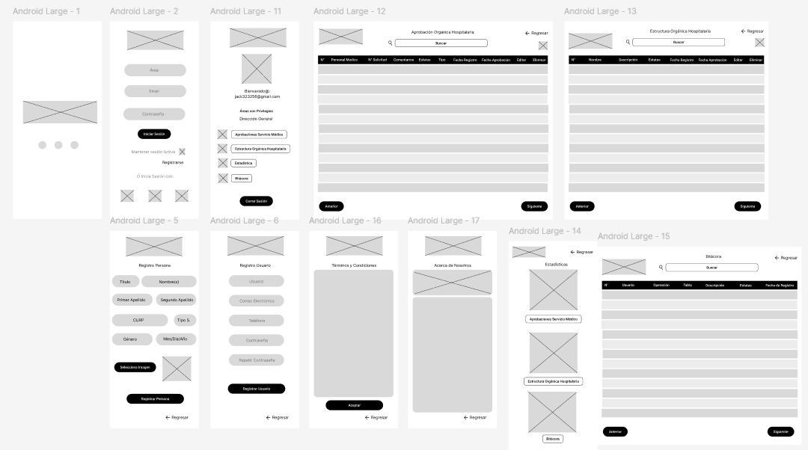** |Se ha reestructurado la configuración previa realizada en los bocetos iniciales mencionados en la sección de Skechs. Cada uno ha representado el flujo de la interacción esperada. En esta sección se ha modelado de una manera más interpretativa la colocación de cada uno de los electos que corresponden a imágenes, iconos, casillas y selectores, que den un mejor entendimiento para la maquetación posterior por parte del equipo de desarrollo y facilitara al desarrollador Front-End como debe de interpretarse los elementos. La representación de los módulos se puede consultar en el siguiente enlace. 
https://www.figma.com/design/gF8AeYmdnw069B9mE2CLlO/Wireframe-Direccion-General-App?node-id=0-1&node-type=canvas|

|**Mockups en Figma** |**Descripción** |
| - | - |
|**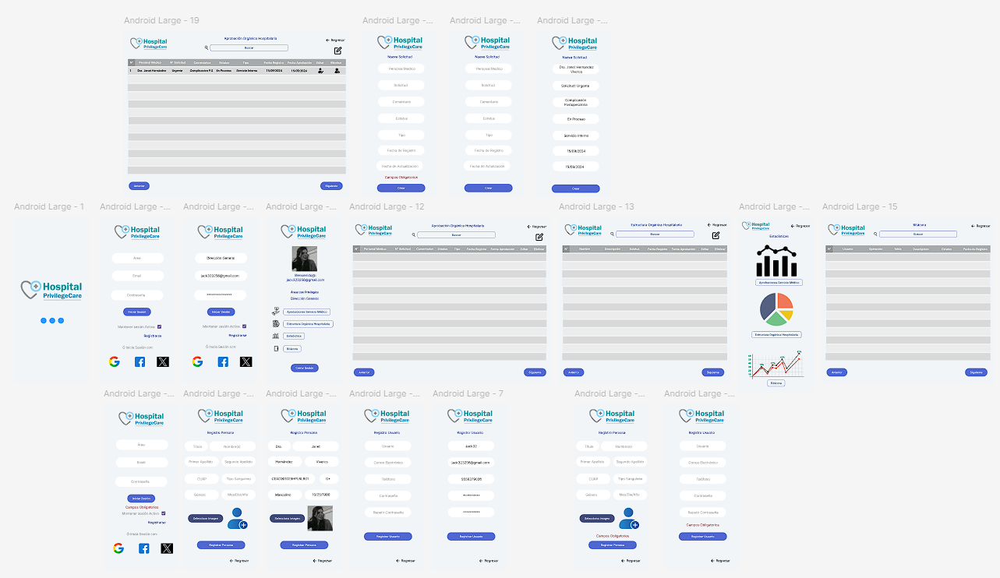** | La representación de los Mokups facilitará el desarrollo por parte del equipo de desarrollo Front-End. En él se especifican de manera objetiva los colores propuestos, dimensiones de formularios y las dimensiones que se deben de modelar para que la aplicación sea más dinámica; además, se puede dar un mejor entendimiento de lo que se pretende crear en el proyecto final. Este modelo permite dar un mejor panorama de lo que el cliente necesita.
https://www.figma.com/design/0t2dq3pWZYl7BOSUw25aC8/Dise%C3%B1o-Propuesto-Direcci%C3%B3n-General?node-id=0-1&node-type=canvas|

## Requerimientos Funcionales

Los requerimientos Funcionales son una parte esencial del proyecto, de ellos dependerá como el sistema debe funcionar de acuerdo a la configuración y distribución del entorno web, siguiendo el patrón antes mencionado en la propuesta anterior mente mencionado se explicarán alguna funciones esenciales en el maquetado web.

**** 

## Requerimientos No Funcionales

Este tipo de requerimientos es lo que el usuario no puede visualizar, sin embargo, son la parte clave en la configuración del sistema, obedeciendo al esquema lógico y el comportamiento esperado en la configuración de la programación.  

**** 

## Reglas de Negocio 

1.	Para crear nuevas tablas dentro del sitio web solo se podrán realizar dentro del Framework de desarrollo en Django, esto permitirá que en cada migración la estructura diseñada para el manejo de los datos se respete y no provoque problemas en la compilación de la información.

2.	El usuario con las credenciales de acceso permitidas podrá ingresar dentro del entorno de MySQL, teniendo los privilegios de consulta, actualización y eliminación de la información, sin embargo, los cambios que realice en la estructura de las tablas no se guardarán debido a que la estructura esta configurada desde Django por lo que en cada migración restaurará la estructura de los modelos que se han establecido.  

3.	Los modelos configurados en Django solo podrán ser vinculados por la configuración desde el root, serializador, administrador, por lo que se necesitan credenciales de usuario para la consulta de estos modelos creados en el API, esto asignará una ruta única de enlace dentro de la conexión establecida. 

4.	Los privilegios solo se podrán otorgar desde la administración principal de Django para las consultas internas hacia los modelos de la API.

5.	Para la vinculación de inicio de sesión mediante Google es necesario crear una cuenta que permita administrar la API de Google, esta otorgará la credencial y llave única para dar acceso a la aplicación que se está desarrollando, esto restringirá el acceso solo a personal autorizado.

6.	Como protección del proyecto las variables de entorno deben de estar ocultas para evitar conflictos futuros o en producción, estas variables se utilizan para almacenar información específica del usuario, como la ruta de acceso a una instalación local de bibliotecas que no deben ser utilizadas por todos los usuarios, valores específicos de programas instalados sólo para usuarios concretos, por lo que este método de seguridad permitirá salvaguardar la información principal del sistema y datos. 

7.	Para la búsqueda específica de la información que se encuentra en las tablas de las páginas con acceso restringido se debe de implementar un script único que se active al llamar la solicitud buscar, esto vinculado a una etiqueta única que responda a esta solicitud, esto evitará que se busque información no validada e inexistente de la tabla. 

8.	La configuración de estilos debe de respetar los parámetros establecidos por la guía de colores y estilos del proyecto, para una optimización del uso de estilos se puede utilizar CSS puro u frameworks de estilización como lo es Bootstrap o Tailwind, por lo que se deberán instalar sus librerías para una mejor optimización en los procesos de desarrollo evitando depender en todo momento de una conexión constante a internet, sin embargo, esto permitiría aligerar el peso del proyecto de cierto modo.

9.	Cada cambio en la maquetación y codificación en el desarrollo del proyecto debe ser comentado de manera escrita y respaldado en copias de seguridad, esto permitirá corregir errores en la operación de los servicios y módulos conectados, el versionamiento de cada proceso es importante registrando a los involucrados en el desarrollo.

10.	  Al igual que con las tablas el buscador principal que se planteó para el menú de inicio debe de relacionar la búsqueda especifica en todo el sitio web por lo que su configuración debe de obedecer a la integración de todos los módulos que se integran en el Body del HTML, esta configuración script debe de integrarse en todas las vistas donde aparezca el menú principal. 

## Documentación Completa

****[Documentacion](/Documentacion/) 

